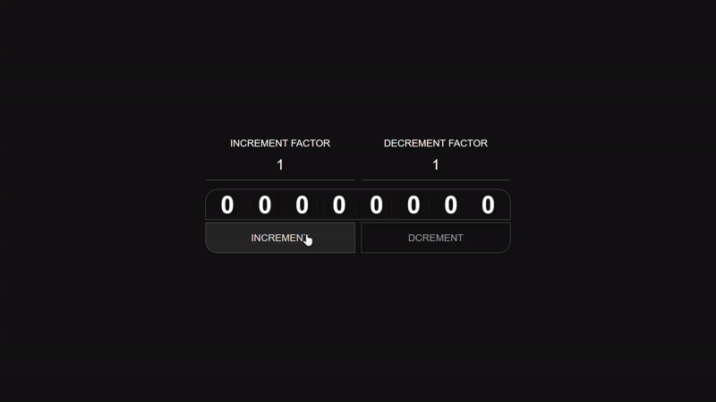

# Dynamic Counter

( <a style='color:skyblue' href='https://text-grid-shader.onrender.com/' >View Live</a> )

A dynamic counter that provides an engaging and interactive experience with real-time updates and smooth animations.

Preview 

# 💻 Tech Stack:
   

## About
This project features a dynamic counter that offers an engaging and interactive experience with real-time updates and smooth animations. It leverages powerful libraries like GSAP for fluid motion and provides a visually appealing interface, showcasing the effective use of modern web technologies to enhance user interaction. 🚀
